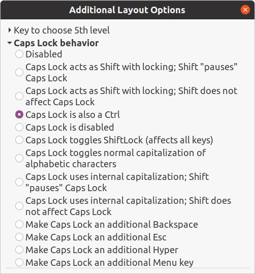

# Map Caps Lock key to Ctrl and Escape in GNOME

Map Caps Lock key to Escape when pressed alone and Ctrl+<something> when pressed along any other key.

Set Caps Lock behaviour to `Caps Lock is also a Ctrl` in Gnome Tweaks:



```sh
sudo apt install -y xcape
```

Add to `.profile`

```sh
xcape -e '#66=Escape'
```

Source: https://askubuntu.com/questions/1220552/how-do-i-set-caps-to-both-control-and-escape-in-ubuntu-gnome
